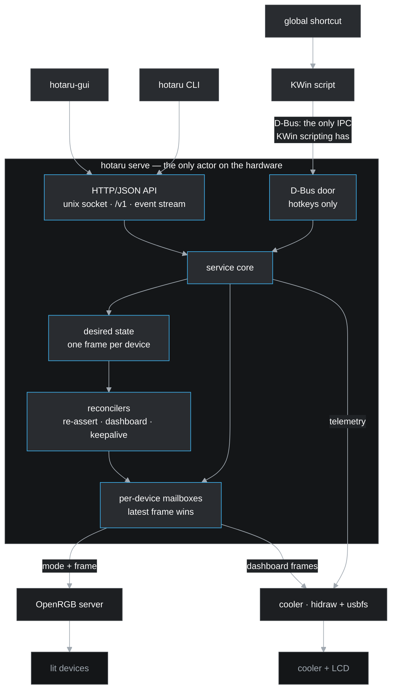

# hotaru

*lights, cooler, action!*

**Version**: 0.1.0

RGB lighting and AIO cooler control for Linux, as a CLI, a user service and a
desktop GUI. 蛍 — fireflies, small lights that pulse.

It drives lighting through [OpenRGB](https://openrgb.org/) and reaches a liquid
cooler itself, over `/dev/hidraw` and usbfs: set colours down to individual
fans, define scenes, put a live dashboard on the cooler's screen, and bind it
all to keys.

> **Status**: all of it works — lighting, the cooler, its screen, scenes, the
> hotkeys, the CLI, the service and its API, the mapping wizard and the
> window. Tested on two machines with nothing in common; the second was mapped
> end to end by its owner, who had never run it, with no configuration written
> by hand. What is not done is listed in the [Roadmap](#roadmap).

## Contents

- [What it does](#what-it-does)
- [Install](#install)
- [Architecture](#architecture)
- [What it runs on](#what-it-runs-on)
- [Roadmap](#roadmap)
- [Where it comes from](#where-it-comes-from)
- [Documentation](#documentation)
- [Licence](#licence)
- [Changelog](#changelog)

## What it does

| | |
|---|---|
| **Lighting** | Every device OpenRGB can see, addressed by device, zone, LED range, or a segment you name once — so "top fan red, bottom fan blue" is a thing you can say |
| **Scenes** | A named set of colour assignments, an effect per device and what the screen shows, applied as a unit — with a preview you can hold while you decide |
| **The cooler** | Coolant and CPU temperature, pump and fan speeds, read where the kernel has no driver for the device |
| **The screen** | The cooler's LCD: its own readout, an image, an animation, or a live dashboard rendered from the telemetry |
| **Hotkeys** | Scenes on global shortcuts: nine shipped on `Ctrl+Alt+Num1`–`Num9`, the shifted row left free for your own. On Plasma through a KWin script installed on every KWin start; on any other desktop by binding the CLI in that desktop's own shortcut editor |
| **A window** | `hotaru-gui`: the machine's devices and zones drawn as a picture of what each is showing, a scene editor you point at a fan, a screen editor, a picture library, and the hotkey binder on the row that shows the key |

## Install

### Arch, and anything using the AUR

```console
$ paru -S hotaru hotaru-gui     # or hotaru alone, on a machine with no desktop
```

[`hotaru`](https://aur.archlinux.org/packages/hotaru) is one PKGBUILD building
both, from the release tarball.

`hotaru` is the CLI and the service and needs no graphics stack, so it
installs on a headless box; `hotaru-gui` is the window. Installing pulls in
OpenRGB, because hotaru contains no lighting drivers of its own — see
[docs/packaging.md](docs/packaging.md) for why the backends are hard
dependencies rather than a list of suggestions.

### Anywhere else

```console
$ go install github.com/ushineko/hotaru/cmd/hotaru@latest
$ go install github.com/ushineko/hotaru/cmd/hotaru-gui@latest   # needs cgo and OpenGL
```

The service unit, the desktop entry and the udev rule are in
[`packaging/`](packaging/) to copy into place. A release also carries built
binaries.

### Then, once

```console
$ systemctl --user enable --now hotaru
$ loginctl enable-linger $USER    # so lighting comes back at boot, not at login
```

Neither is run for you by the package: starting a daemon and turning on a user
manager at boot are your decisions. `hotaru light health` says which one is
missing when something is.

The cooler needs no root — logind puts an ACL on a device the package's udev
rule tags — but the rule only applies to a device plugged in after it lands,
so the first run after installing may want a reboot or
`udevadm trigger`. `hotaru light health` reports a device it can see and
cannot open as exactly that.

### And then

```console
$ hotaru light list        # what it found
$ hotaru light set red     # it works
$ hotaru wizard            # name this machine's lights by looking at them
```

The wizard is optional. With no configuration at all, every device OpenRGB
reports is in scope and every decision comes from what the hardware says about
itself; rules narrow and correct, and never enable.

## Architecture

One program, three faces: a resident service that owns the hardware, and a CLI
and GUI that are clients of it.



The decisions worth knowing before reading any code:

- **The service is the only writer.** No shell ever holds a device handle. Two
  callers cannot fight over a device because there is only ever one caller, and
  that is true from the first commit rather than something the project grew into.
- **The API is the contract.** HTTP and JSON over a Unix socket in
  `$XDG_RUNTIME_DIR` — no port, because the socket's filesystem permissions are
  the authentication and adding a listener would mean adding auth to go with it.
  The CLI is its first client; the GUI is another; a future Go rewrite of
  [peripheral-battery-monitor](https://github.com/ushineko/peripheral-battery-monitor)
  is meant to be a third.
- **It starts with the machine, not with your desktop.** The service is a user
  unit with no session dependency, so the lights come back at boot rather than
  when someone logs in. It waits for OpenRGB to actually have your devices
  rather than for its unit to claim it started, because those are not the same
  thing.
- **Desired state, not fire-and-forget.** hotaru holds what *should* be true and
  reconciles toward it, because some hardware does not hold what it is told — a
  wireless mouse restores its onboard colour on wake, and the cooler's LCD drops
  a static image within seconds while retaining a GIF indefinitely.
- **It is fast because of its shape, not its tuning.** A whole scene across six
  devices is 2.4 ms service-side, against roughly 180 ms for the tool this
  replaces: one persistent socket rather than a subprocess per device, one
  frame per device rather than a mode call and a colour call, and no queue to
  wait behind.
- **A frame per device.** Assignments compose into one complete frame before any
  write, so a write is atomic from the device's point of view, coalescing cannot
  drop half a scene, and "is this device showing what it should?" has an answer.
- **Nothing is required.** OpenRGB is optional at runtime, and so is the cooler.
  Absent ones are reported as absent and their features disappear from the
  interface; the service still starts and serves.
- **A fresh install is inert.** With nothing recorded, hotaru discovers your
  hardware and touches none of it until asked — so installing it cannot stamp
  over lighting you configured elsewhere.
- **It should work out of the box.** No configuration file to write, nothing to
  read first, and diagnostics that name the remedy rather than the symptom —
  with anything hotaru can fix itself offered as a question rather than done
  behind your back. Everything here is possible with a shell script; the point
  of a program is to remove the gymnastics, and a feature that removes none has
  not earned its place.

Full detail, including the failure each decision answers, is in
[docs/architecture.md](docs/architecture.md).

## What it runs on

Linux, with a KDE Plasma integration that is a convenience rather than a
dependency. The core — OpenRGB client, scenes, the service, the API — is
portable; the platform pieces (the systemd user unit, the KWin script, the
desktop entry) are build-tagged and their absence costs only those features.

**Lighting is whatever OpenRGB supports** — hotaru contains no lighting drivers
of its own, which is also why installing it installs OpenRGB. The cooler is the
exception: hotaru speaks NZXT's protocol directly, so telemetry and the screen
need no Python and no separate tool (spec 012).
[docs/hardware.md](docs/hardware.md) lists what has actually been tested, and
points at OpenRGB's own device list for everything else.

Nothing is assumed about your hardware. The machine this was written for is a
test case, not the target: scope defaults to every device OpenRGB reports, and
device quirks are discovered by reading back what a write actually did rather
than by matching names against a table someone else's desk produced. The
acceptance test is a second machine with entirely different hardware, where
installing and using hotaru must take no extra steps.

## Roadmap

| Spec | | |
|---|---|---|
| 001 | Scope, migration contract, and the baseline: the service, its API, and lighting | **done** — [#1](https://github.com/ushineko/hotaru/issues/1) |
| 008 | The mapping wizard: naming a machine's lights by looking at them | **done** — [#10](https://github.com/ushineko/hotaru/issues/10) |
| 002 | Cooler telemetry behind the same API | **done** — [#2](https://github.com/ushineko/hotaru/issues/2), and replaced by [spec 012](specs/012-the-cooler-without-liquidctl.md): hotaru reads the cooler itself |
| 003 | The LCD and the dashboard | **done** — [#3](https://github.com/ushineko/hotaru/issues/3) |
| 004 | Scenes, preview and leases | **done** — [#4](https://github.com/ushineko/hotaru/issues/4) |
| 005 | The GUI on [fynedesygn](https://github.com/ushineko/fynedesygn) | **done** — [#5](https://github.com/ushineko/hotaru/issues/5), built out over specs 017 to 034 |
| 006 | Hotkeys and the cutover | **done** — [#6](https://github.com/ushineko/hotaru/issues/6) |
| 007 | Packaging and release | **done** — [#7](https://github.com/ushineko/hotaru/issues/7) |

Still open, and named rather than quietly missing: a resizable zone with no
length set is not asked about by the wizard ([spec 008](specs/008-the-mapping-wizard.md)
AC14), and the package has not yet been built from a pushed tag and installed
on a machine that never had liquidctl ([spec 007](specs/007-packaging-and-release.md)
AC8).

## Where it comes from

All of this lived in `peripheral-battery-monitor`, a KDE tray widget for
peripheral battery levels that grew a cooling monitor, an LCD dashboard, an RGB
controller and a hotkey host because that is where the serialising queue
happened to be.

hotaru is a rearchitecture rather than a port. What carries over is the
knowledge — eleven measured hardware facts, and the KDE global-shortcut rules
that four separate investigations established. What does not carry over is the
structure, or the tests: a behaviour that cannot cite the fact making it
necessary is an artefact of where it used to live.

## Documentation

- [specs/001-scope-migration-and-lighting-core.md](specs/001-scope-migration-and-lighting-core.md):
  scope, the migration contract, the KDE hotkey rules, acceptance criteria.
- [specs/008-the-mapping-wizard.md](specs/008-the-mapping-wizard.md): the
  wizard's questions, and what using it on two machines taught.
- [specs/009-writes-that-mean-what-they-say.md](specs/009-writes-that-mean-what-they-say.md):
  why a write that lands in the buffer is not always a write, and what hotaru
  checks instead.
- [specs/007-packaging-and-release.md](specs/007-packaging-and-release.md):
  what the package installs, and the udev rule whose absence is invisible.
- [specs/034-a-picture-is-a-picture.md](specs/034-a-picture-is-a-picture.md):
  the library as a grid, and the frame count that decoded 414 MB to produce a
  number.
- [specs/032-the-display-and-a-machine-without-one.md](specs/032-the-display-and-a-machine-without-one.md):
  saying which screen was found, and working when there is not one.
- [specs/027-a-thumbnail-is-not-an-animation.md](specs/027-a-thumbnail-is-not-an-animation.md):
  what the window's memory was doing, and the measurement that was read wrong
  the first time.
- [specs/026-a-scene-is-a-list-not-a-column.md](specs/026-a-scene-is-a-list-not-a-column.md):
  what 225 lines in a column cost, and what a list costs instead.
- [specs/025-the-editor-is-mostly-blocks.md](specs/025-the-editor-is-mostly-blocks.md):
  why the scene editor was slow to resize, and what a colour block costs.
- [specs/024-the-check-that-cost-four-fifths.md](specs/024-the-check-that-cost-four-fifths.md):
  the first profile of the window, and the debug check that was most of it.
- [specs/023-a-dashboard-you-can-change.md](specs/023-a-dashboard-you-can-change.md):
  the dashboard editor, and the font cache that killed the service when two
  goroutines drew at once.
- [specs/022-more-to-read.md](specs/022-more-to-read.md): the nine numbers the
  machine can report, and why utilisation is absent the first time it is asked.
- [specs/021-the-window-says-what-this-is.md](specs/021-the-window-says-what-this-is.md):
  the About section, and why it is this file rather than a summary of it.
- [specs/020-a-scene-from-a-picture.md](specs/020-a-scene-from-a-picture.md):
  reading a picture as lighting, and why a slice of a photograph is not its
  average either.
- [specs/019-a-wallpaper-on-the-cooler.md](specs/019-a-wallpaper-on-the-cooler.md):
  converting a picture for a panel that refuses everything else by showing
  nothing.
- [specs/018-pointing-at-a-fan.md](specs/018-pointing-at-a-fan.md): the scene
  editor, and why a draft is not a preview and a preview is not a scene.
- [specs/017-the-window-and-what-it-shows.md](specs/017-the-window-and-what-it-shows.md):
  the GUI's first window, what it draws, and why it has no glance panel.
- [specs/013-the-dashboard.md](specs/013-the-dashboard.md): the monitor's LCD
  dashboard ported, and the settling time the panel turns out to need.
- [specs/012-the-cooler-without-liquidctl.md](specs/012-the-cooler-without-liquidctl.md):
  reaching the cooler and its screen directly, and what the panel's memory does
  under repeated writes.
- [specs/011-a-zone-is-what-the-hardware-writes.md](specs/011-a-zone-is-what-the-hardware-writes.md):
  why a device's zones are written separately, and the day spent not asking
  what was on the wire.
- [specs/010-the-mode-packet-is-the-commit.md](specs/010-the-mode-packet-is-the-commit.md):
  the packet that looks redundant and is not, and a metric that improved
  because hotaru stopped talking to the hardware.
- [docs/architecture.md](docs/architecture.md): the system diagram and what it
  asserts.
- [examples/hotaru.yml](examples/hotaru.yml): a worked rules file from a real
  machine — device corrections and named segments, none of it a default.
- [docs/api.md](docs/api.md): the service's HTTP interface, with recorded
  transcripts of every route.
- [docs/migration.md](docs/migration.md): what moves out of
  `peripheral-battery-monitor`, the cutover order, and the KDE hotkey rules
  four investigations paid for.
- [docs/hardware.md](docs/hardware.md): hardware that has been tested, the
  upstream device lists for everything else, and how to check your own machine.
- [docs/packaging.md](docs/packaging.md): the AUR packages, the dependency
  question, and the release flow.

## Licence

MIT. See [LICENSE](LICENSE).

## Changelog

### 0.1.0 (2026-09-21)

The first tagged release, and so the whole program: lighting through OpenRGB
addressed down to a single LED, a liquid cooler read and driven directly, its
screen showing a picture or a live dashboard, scenes on global shortcuts, a
mapping wizard that names a machine's lights by lighting them and asking, and
a window for all of it. Everything below is in it.

- The window's hold on the hardware has a test, against a real service rather
  than fixed JSON: the lease is taken once and kept across colours, and
  letting go puts the lights back. Spec 018 described both halves and had
  nothing between the service's lease tests and the editor that uses them,
  which is the gap a preview is worst to have.

- The AUR package, the udev rule that lets the service open the cooler without
  root, and an Install section in this README. The rule is the part that is
  easy to leave out and impossible to notice: without it hotaru finds the
  cooler and cannot open it, so lighting works while telemetry and the screen
  do not. It came from `liquidctl` on the machine this was written on, and
  hotaru stopped depending on that in spec 012 (spec 007, #7).

- Pictures are a grid of tiles rather than a column of cards. A card gave the
  picture a square an inch across and the rest of the line to its size and the
  directory every picture is in, so eighteen pictures were eighteen screens of
  mostly nothing. The grid reflows to the window's width, and the thumbnails
  are drawn from the shared cache and decoded off the drawing thread.

- Listing the pictures does not decode them. `Image.Frames` says whether a
  picture moves and was counted with `gif.DecodeAll`, which undoes the
  compression of every frame of every file: 110 MB of animation on this
  machine, so `hotaru image list` took 1.28 seconds — and the window asks for
  that list whenever the Pictures section is drawn. Counting image
  descriptors without decoding a pixel takes 0.019 seconds (spec 034, #77).

- System says which display was found: the panel the cooler model has, "none"
  for one without, or the panel and the reason when it cannot be reached.
  `hotaru cooling` says the same. Asking the device would mean claiming the
  interface, which would take somebody's screen off liquidctl to answer a
  question nobody asked (spec 032, #73).

- A screen that will not open is an absence rather than a fault. Another
  program holding the interface, or a usbfs node this user may not open, made
  every scene report "the screen: permission denied" permanently — all nine
  shipped scenes name a screen state — and made the dashboard loop fail every
  two seconds for the life of the service. The lights still work, the loop
  stops after one refusal, and the Screen section says so once at the top and
  stays open: a screen is a file, and it travels to a machine that has a panel
  (spec 032, #73).

- `hotaru scene adopt` takes the pictures scenes point at into the library. A
  scene written before hotaru kept pictures names a file wherever it happened
  to be, which works until the file moves — and the window could not offer it,
  because the chooser lists what hotaru keeps. The original is left where it
  is (spec 033, #74).

- Colours taken from a picture are pushed apart as far as somebody asks. A
  slice of a starfield averages to dark grey and a slice of a sunset to brown,
  so the mean is weighted by chroma now — and even then a photograph is mostly
  one hue, so a separation slider scales each colour away from the picture's
  average hue. A machine lit from a nebula was olive; it is not now. The same
  slider recolours a scene already saved, `hotaru scene recolour` does it at
  the terminal, and a dashboard is a source for a scene the same way a picture
  is (spec 029, #70).

- Pictures, Screen and Scenes are one entry called Create, in the order
  somebody does them in, and Cooling is part of System rather than an entry of
  its own for four readings. System also says what is loaded: the scene last
  applied and what the panel is showing, refilled on the poll rather than
  rebuilt, so the device rows are not rebuilt twice a minute to show a pump
  speed (spec 030, #71).

- A row's buttons sit beside it. They were pinned to the window's edge, so a
  wide window left a hand's width of nothing between the end of a line and the
  button belonging to it — four pixels now against 1,471 — and every column
  holds a width, so `Shift+1` being wider than `6` no longer moves everything
  after it (spec 031, #72).

- The screen chooser opens at once. It asked the service for the pictures and
  the dashboards to build its list and then again for every line in it: thirty
  round trips on the thread drawing the window, growing with the number of
  pictures kept. The list is fetched once and refreshed when the navigation
  arrives. Its thumbnails line up with the options too — a VBox pads between
  its children and Fyne's radio group does not, so by the tenth option the
  picture was beside the wrong name (spec 031, #72).

- The window has an Appearance section, like every other program on
  fynedesygn: the scheme, the font, the text size and the interface scale.
  Fyne draws its own widgets, so those are the whole of what makes this window
  look like it belongs on the desktop it is running on.

- Tables in the About section read like tables, from fynedesygn v0.1.34.

- A scene's shortcut is changed from the row that shows it. The key was
  already the first thing on the line and the one thing on it the window could
  not change; it is a button now, and the chooser offers every key with what
  each one holds — rearranging a bank means moving keys between scenes, so
  hiding the taken ones would hide the rearrangement. Moving one is an unbind
  and a bind, because the service binds a key to a scene and does not know a
  scene should have at most one. Binding also reinstalls the desktop's script,
  which carries the scene name rather than the key — without that a rebinding
  was right in the file and the old scene kept firing until the service
  restarted, in the window and from `hotaru keys bind` alike (#66).

- Dialogs that hold a list open at most of the window, through fynedesygn's
  `dialogs.Roomy` rather than a copy of it here. The shortcut chooser was
  offering eighteen keys through a slot showing one and a half.

- Choosing a dashboard takes the screen back. Anything that puts a picture on
  the panel holds the dashboard — `hotaru screen show`, the readout, and every
  scene that names an image — and only asking for the dashboard gives it up.
  Choosing one redrew a loop that was not running, so the store changed, the
  panel kept showing the picture, and nothing said why. Saving a dashboard
  still does not take the screen: editing one while a picture is up is not a
  request for the picture to go away (#64).

- Thumbnails are decoded once, small, and shared. The Pictures section cached
  each picture's file bytes and handed them to Fyne, which decodes a GIF in
  full — `berserk-slide` is sixty frames at 640x640 — to draw a square ninety
  six pixels across. A minute of switching sections held 128 MB of decoded
  diagram and 73 MB of paletted frames; the same minute now peaks at 271 MB of
  live heap against 444 MB, with the images down to 21 MB (spec 027, #60).

- Ctrl+1 to Ctrl+9 switch sections, from fynedesygn's shell.

- A scene's lines are a list rather than a column. A scene that names lights
  individually has 225 of them, and each was seven objects that Fyne measured
  on every layout — with a wrapping label re-measuring at every width. The
  list builds the rows on screen and recycles them: resizing the editor with
  that scene loaded went from 9.16 s of CPU in a 25-second drag to 6.10 s, and
  from 18.84 s before any of this work (spec 026, #59).

- Resizing the scene editor costs half what it did. Each light block was a
  rectangle with an invisible button stacked over it — five objects, hundreds
  of blocks, and a scroller lays out everything it holds rather than what is
  visible. They are `widgets.Swatch` now: one widget whose minimum size is the
  number it was given. A 25-second drag went from 18.84 s of samples to 9.16 s
  (spec 025, #57).

- The window is built without Fyne's thread-safety check, which was 82% of the
  CPU of a window drag: Fyne calls `runtime.Stack` on every canvas refresh to
  find out which goroutine it is on, formatting a whole traceback to keep the
  first thirty bytes. The window's own resize work fell 3.8x. Safe here
  because `internal/gui/thread_test.go` fails the build when anything inside a
  `Perform` callback touches the interface unwrapped — the tag and that guard
  are one decision. `make install` is the way to build it; `go install` misses
  the tag (spec 024, #55).

- The window can be profiled. `HOTARU_PPROF=:6060 hotaru-gui` serves
  `net/http/pprof` on loopback, and the window runs under a soft 512 MiB
  memory ceiling that `GOMEMLIMIT` and `HOTARU_MEMLIMIT` override. Both come
  from fynedesygn's `profiling` package; its
  [performance guidance](https://github.com/ushineko/fynedesygn/blob/main/docs/performance.md)
  says what to do with what comes back. The ceiling is a starting point and
  not a measurement: it is the first thing a profile should correct.

- The cooler's screen is something you can change. Named dashboards, saved and
  switched like scenes: four arrangements drawn against the round panel, any
  of the nine readings in each slot with a label of its own, rings that each
  track a reading and thin as they go inwards, four themes, a caption, and a
  background that is the starfield, a plain colour or a picture from the
  library. Text over a picture is outlined, because a photograph will sooner
  or later put a light region under light text. `hotaru dashboard
  list|show|save|use|preview|delete`, an editor in the window with the frame
  previewed beside the form, and `screen: dashboard:quiet` in a scene so one
  keypress changes the lights and the screen together. The shipped `coolant`
  dashboard is spec 013's screen to the pixel (spec 023, #52).

- Five more numbers to read: CPU and GPU utilisation, the pump and fan duty
  cycles the cooler always reported and nothing showed, and fan RPM.
  `hotaru readings` prints all nine with their units, which is how somebody
  finds out whether their graphics card reports utilisation before putting it
  on a panel. A reading is now looked up by name rather than held in a field,
  because a dashboard slot holds a name (spec 022, #51).

- Branding: the byline is "lights, cooler, action!", and the bulb's filament is
  an italic H rather than a zigzag that read as an N. A firefly kanji was tried
  in its place and kept out: it draws well at 128 pixels and is a smudge at 22,
  which is the size the icon is at in a panel (#49).

- The window has an About section, and it is this README: embedded, rendered
  with the architecture diagram drawn at build time, with a link to the
  project. One description of hotaru rather than two, since the one in the
  window is the one that goes stale. `make generate` renders the diagrams
  (spec 021, #49).

- A scene can be deleted from the window. It could only be done from the
  terminal, and nothing flagged it: the parity test runs one way, proving the
  CLI reaches every route the service serves rather than that the window does.
  Not on a shipped scene, which the store keeps whatever is asked of it.

- A scene from a picture. `hotaru image scene <picture> <name>`, and the same
  in the window, lights every zone on the machine with the picture's own
  colours — read across the image rather than averaged, so a twenty-four light
  ring carries the sweep the picture has, and the panel shows the picture it
  came from. Each slice is weighted by how much colour it carries: half of
  every vertical slice through a photograph is background, and averaging that
  in reads a rust planet as grey-brown (spec 020, #47).

- A dropped stack of files all arrives, and is asked about. Dropping four
  photographs processed the first and discarded the rest; they now queue, and
  more than one is a question — four pictures, or one slideshow that holds
  each in turn and fades between them (spec 020, #47).

- Pictures for the cooler's screen. `hotaru image add <name> <file>` converts
  any JPEG, PNG or GIF to the 640x640 GIF the panel takes — cropped to the
  middle rather than letterboxed — and keeps it under `$XDG_DATA_HOME`. The
  window has the same, with a file chooser, drag and drop from a file manager,
  and a preview of the conversion before anything is kept: the crop is the
  decision, and it is shown rather than described (spec 019, #5).

- The palette is chosen from the picture rather than fixed. A photograph
  through Plan 9's 256 colours spends half of them on greens it does not
  contain and speckles everywhere it does; a histogram of the image spends
  every entry on a colour that is in it (spec 019).

- A scene can name a stored picture for the screen, chosen in the editor
  alongside the dashboard and the cooler's own display (spec 019, #5).

- The GUI has a scene editor: click a device or a zone in the picture, give it
  a colour, show the draft on the hardware, save it with a name. Three states
  rather than two — a draft lives in the window, a preview is on the hardware
  and is still not what anybody wants, and saving is what makes it a scene
  (spec 018, #5).

- Editing a scene keeps what the editor does not edit. A scene's effect per
  device and its screen state come through untouched, because an editor that
  understands part of a format and rewrites the whole thing drops the rest
  quietly (spec 018).

- `POST /v1/preview` previews a scene that was never saved, and `hotaru scene
  preview kraken=red keychron=black` does the same from a terminal —
  `--detach` leaves it up under a token instead of holding it (spec 018, #5).

- `hotaru-gui` has an icon: a lit bulb, flat and geometric because it is drawn
  at 22 pixels in a panel far more often than at 128 in a launcher. It ships as
  a desktop entry named for the window's app_id and an SVG in the icon theme,
  which is what KDE needs before it will draw either (spec 017, #5).

- `hotaru-gui` offers every navigation shape fynedesygn has — labels, icons
  alone, or hidden, on the left or along the top — which is a control in the
  header rather than a setting to find (spec 017, #5).

- `hotaru-gui`, the window: a Service section with health and its remedies and
  a way to reconcile, a System view that draws every device with its zones
  proportional to their LED counts and in the colours they are showing, and the
  cooler's numbers beside them. A client like the CLI — it holds no device
  handle, which is a property of what it imports rather than a rule it follows,
  and a test over the import graph says so (spec 017, #5).

- The window keeps view state in `gui.yml` and nothing else. The service owns
  the rules, the scenes and the desired state, and never reads the window's
  file (spec 017).

- An image that is not the panel's size is scaled to fit before it is sent. The
  cooler displays nothing at all for an image of the wrong size — no error, on
  either side — which had five of the development machine's nine LCD animations
  silently blank (spec 016).

- An image larger than four megabytes reaches the cooler's screen. usbfs takes
  one contiguous kernel allocation per transfer, so a bulk write is split into
  one-megabyte pieces; four of the development machine's nine LCD animations
  are between 9 and 20 MB and none of them had ever been sent (spec 016).

- Scenes on hotkeys. Nine shipped scenes — red, green, blue, purple, cyan,
  orange, white, magenta and off — on `Ctrl+Alt+Num1` to `Num9`, which is the
  bank `peripheral-battery-monitor` has had on this hardware for two years, read
  out of its own configuration rather than reinvented.
  `Ctrl+Alt+Shift+Num1..9` are left free for scenes you write yourself
  (spec 016, #6).

- `hotaru keys` says what is bound, what is reserved, and **what else is
  holding those sequences** — the fault that makes a shortcut register
  successfully and then do nothing. `hotaru keys release` removes another
  program's stale entries by asking KDE to forget them, after showing you them
  — in your own process, because the service is deliberately not permitted to
  touch that file. `hotaru keys bind` and `unbind`
  change what a key does (spec 016, #6).

- The KWin script is installed on **every** appearance of KWin, not once at
  start-up: the shortcuts live exactly as long as the loaded script, so a KWin
  restart used to take them silently (spec 016, #6).

- A scene can turn the lights off. "Off" is not a colour — it resolves the
  device's own Off mode and honours the keyboard that treats black as a dead
  backlight — which is what the ninth key has always done (spec 016, #6).

- A machine with no cooler no longer reports a problem when a scene names a
  screen state. Absence is an ordinary answer, and the nine shipped scenes name
  one (spec 016).

- Scenes: `hotaru scene write`, `apply`, `preview`, `save`, `list`, `show` and
  `delete`. A scene is colours addressed at whatever depth you meant them, an
  effect per device, and what the cooler's screen shows — applied as a unit and
  kept, so it survives a reboot and hardware that forgets. A scene that says
  nothing about the screen leaves it alone (spec 015, #4).

- `hotaru scene preview` shows a scene without keeping it, and hotaru stops
  re-asserting colours to the devices it covers so the draft is not corrected
  underneath you. The preview ends when the command does — including when it is
  killed — and the lights go back to what was last applied. `hotaru preview`
  says who is holding one; `hotaru preview release` ends it (spec 015, #4).

- A re-assert now restores the mode as well as the colours. Invisible while
  every scene was a solid colour; wrong as soon as one carries an effect, since
  a keyboard rippling under typing came back from a re-assert sitting in Direct
  (spec 015).

- The README, the architecture diagram and the hardware page no longer say the
  cooler is reached through liquidctl, or that the CPU temperature comes from
  OpenLinkHub. Neither has been true since spec 012, and the docs were still
  describing the architecture the project replaced.

- The cooler's screen shows a live dashboard: coolant temperature with a
  severity-coloured ring, the processor, the graphics card and the pump, over a
  starfield. `peripheral-battery-monitor`'s design, ported constant for
  constant. hotaru pushes only when the picture would look different and never
  faster than the panel will settle, which is a floor set by the size of the
  encoded frame — 0.6% of one core, measured (spec 013, #3).

- `hotaru screen dashboard` puts it back after `hotaru screen show` or
  `hotaru screen readout` has taken the panel. The screen holds one picture, so
  it has one author at a time: a picture replaced two seconds later was not
  shown (spec 013, #3).

- `hotaru screen` puts a picture on the cooler's panel, sets its brightness and
  orientation, and hands it back. hotaru hands it back on the way out too, so a
  machine that has stopped running it is not left showing a stale picture
  (spec 012, #2).

- `hotaru cooling` reads the liquid cooler without liquidctl: coolant
  temperature, pump and fan, over `/dev/hidraw` at about two milliseconds
  against a hundred and five through a Python interpreter. A machine with no
  cooler says so and everything else is unaffected (spec 012, #2).

- The wizard ends by offering to light the machine with what it just learned.
  A device named for the first time has no remembered state, so a first run
  used to finish with a written file, a dark keyboard, and an instruction to go
  and type another command (#34).

- `hotaru light map --devices`, with nothing after it, offers the list to pick
  from. Device names are the hardware's own and long enough to mistype, and a
  mistyped one maps nothing while looking like it worked.

- The wizard waits for the hardware before asking what you can see, and asks
  what it never asked before: whether the lights actually go off, what to do
  when they do not, and whether a device that can be dimmed should be. A
  keyboard that takes the lighting back when told to go dark is now found and
  written down instead of leaving `hotaru light off` quietly not working
  (spec 014, #20, #25).

- `hotaru light health` names the OpenRGB unit this machine actually uses. A
  later candidate overwrote an earlier one, so a machine with the user unit
  installed but stopped was told to `sudo systemctl start openrgb.service` --
  the wrong unit, the wrong scope, and the only advice hotaru offers when
  lighting is not working (#30).

- A frame is written one request per zone rather than one for the whole
  device. An NZXT cooler's two channels are independent controllers behind one
  USB endpoint, and a single array spanning both was never delivered together:
  one channel held a stale colour while the other moved, frames rendered torn
  part way along a chain of fans, and a run of writes stopped it responding for
  minutes. A zone is not a way of naming part of a device -- on some hardware
  it is a separate controller (spec 011, #24).

- The mode packet is sent on every write, including to a device already in
  that mode. It looks redundant and is the commit: suppressing it stopped an
  NZXT cooler changing colour at all (spec 010, #23).

- `--preview` on `hotaru light set` and `hotaru light off`: write a colour to
  the hardware without making it the state the machine returns to. Setting
  colours to find out which fan is which no longer leaves the last one as what
  a reboot restores (#18).

- A solid colour is now set on the mode as well as on the device's buffer,
  where the mode is one that carries its own. Without it, a device put into
  such a mode showed the colour its vendor last stored there: asked for purple,
  an NZXT cooler lit three radiator fans red and every check reported success.
  hotaru now also prefers a mode whose colour it sets per LED, because that is
  the one it can read back and check (spec 009, #16).

- The wizard asks how many things are chained on a part only where that part is
  a line of lights. A keyboard's keys are addressable and are not a chain, and
  the question had no answer (spec 008, #15).

- The mapping wizard: `hotaru light map` lights one thing at a time and asks
  what you can see, and the names you give become the ones you use. Tested end
  to end on a machine the author has never seen (spec 008, #10).

- Desired state, and the reconciler that puts the lights back: at boot, when a
  device wakes up having forgotten, and when a server hands devices back with no
  colour. A fresh install remembers nothing and so writes to nothing.
- `hotaru light probe`, `status`, `reconcile` and `reload`; per-device write
  queues where a newer request replaces a waiting one rather than queueing
  behind it; and the systemd user unit, which depends on no OpenRGB unit and on
  no desktop session.
- `hotaru serve` and the CLI: the service on its Unix socket, `/v1` for health,
  devices and lighting, and `hotaru light list|set|off|health` as its first
  client. The client commands import no device package, which a test asserts.
- Spec 001: project scope, the migration contract from
  `peripheral-battery-monitor`, the KDE hotkey rules, and the baseline —
  service, API and lighting ([#1](https://github.com/ushineko/hotaru/issues/1)).
- The architecture and the packaging plan, decided ahead of implementation.
