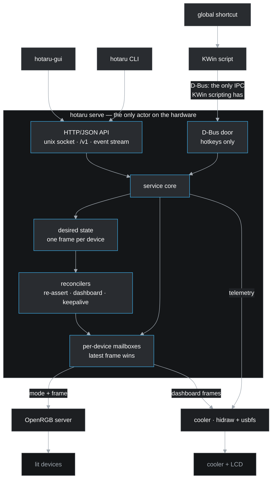

# hotaru

**Version**: unreleased — specified, not yet built

RGB lighting and AIO cooler control for Linux, as a CLI, a user service and a
desktop GUI. 蛍 — fireflies, small lights that pulse.

It drives lighting through [OpenRGB](https://openrgb.org/) and reaches a liquid
cooler itself, over `/dev/hidraw` and usbfs: set colours down to individual
fans, define scenes, put a live dashboard on the cooler's screen, and bind it
all to keys.

> **Status**: the lighting half works. The service, its API, the CLI and the
> mapping wizard are built and tested on two machines with nothing in common —
> the second one mapped end to end by its owner, who had never run it, with no
> configuration written by hand. The cooler, the LCD, scenes, the GUI and the
> hotkeys are specified and not yet built; see [Roadmap](#roadmap).

## Contents

- [What it does](#what-it-does)
- [Architecture](#architecture)
- [What it runs on](#what-it-runs-on)
- [Roadmap](#roadmap)
- [Where it comes from](#where-it-comes-from)
- [Documentation](#documentation)
- [Licence](#licence)
- [Changelog](#changelog)

## What it does

| | |
|---|---|
| **Lighting** | Every device OpenRGB can see, addressed by device, zone, LED range, or a segment you name once — so "top fan red, bottom fan blue" is a thing you can say |
| **Scenes** | A named set of colour assignments plus an LCD mode, applied as a unit |
| **The cooler** | Coolant and CPU temperature, pump and fan speeds, read where the kernel has no driver for the device |
| **The screen** | The cooler's LCD: its own readout, an image, an animation, or a live dashboard rendered from the telemetry |
| **Hotkeys** | Scenes on global shortcuts. On Plasma through a KWin script; on any other desktop by binding the CLI in that desktop's own shortcut editor |
| **A GUI** | Manage the service, see the machine's devices and zones drawn as a picture, stage a scene, preview it on the hardware, name the segments you just worked out, save it |

## Architecture

One program, three faces: a resident service that owns the hardware, and a CLI
and GUI that are clients of it.

The decisions worth knowing before reading any code:

- **The service is the only writer.** No shell ever holds a device handle. Two
  callers cannot fight over a device because there is only ever one caller, and
  that is true from the first commit rather than something the project grew into.
- **The API is the contract.** HTTP and JSON over a Unix socket in
  `$XDG_RUNTIME_DIR` — no port, because the socket's filesystem permissions are
  the authentication and adding a listener would mean adding auth to go with it.
  The CLI is its first client; the GUI is another; a future Go rewrite of
  [peripheral-battery-monitor](https://github.com/ushineko/peripheral-battery-monitor)
  is meant to be a third.
- **It starts with the machine, not with your desktop.** The service is a user
  unit with no session dependency, so the lights come back at boot rather than
  when someone logs in. It waits for OpenRGB to actually have your devices
  rather than for its unit to claim it started, because those are not the same
  thing.
- **Desired state, not fire-and-forget.** hotaru holds what *should* be true and
  reconciles toward it, because some hardware does not hold what it is told — a
  wireless mouse restores its onboard colour on wake, and the cooler's LCD drops
  a static image within seconds while retaining a GIF indefinitely.
- **It is fast because of its shape, not its tuning.** A whole scene across six
  devices is 2.4 ms service-side, against roughly 180 ms for the tool this
  replaces: one persistent socket rather than a subprocess per device, one
  frame per device rather than a mode call and a colour call, and no queue to
  wait behind.
- **A frame per device.** Assignments compose into one complete frame before any
  write, so a write is atomic from the device's point of view, coalescing cannot
  drop half a scene, and "is this device showing what it should?" has an answer.
- **Nothing is required.** OpenRGB is optional at runtime, and so is the cooler.
  Absent ones are reported as absent and their features disappear from the
  interface; the service still starts and serves.
- **A fresh install is inert.** With nothing recorded, hotaru discovers your
  hardware and touches none of it until asked — so installing it cannot stamp
  over lighting you configured elsewhere.
- **It should work out of the box.** No configuration file to write, nothing to
  read first, and diagnostics that name the remedy rather than the symptom —
  with anything hotaru can fix itself offered as a question rather than done
  behind your back. Everything here is possible with a shell script; the point
  of a program is to remove the gymnastics, and a feature that removes none has
  not earned its place.

Full detail, including the failure each decision answers, is in
[docs/architecture.md](docs/architecture.md).

## What it runs on

Linux, with a KDE Plasma integration that is a convenience rather than a
dependency. The core — OpenRGB client, scenes, the service, the API — is
portable; the platform pieces (the systemd user unit, the KWin script, the
desktop entry) are build-tagged and their absence costs only those features.

**Lighting is whatever OpenRGB supports** — hotaru contains no lighting drivers
of its own, which is also why installing it installs OpenRGB. The cooler is the
exception: hotaru speaks NZXT's protocol directly, so telemetry and the screen
need no Python and no separate tool (spec 012).
[docs/hardware.md](docs/hardware.md) lists what has actually been tested, and
points at OpenRGB's own device list for everything else.

Nothing is assumed about your hardware. The machine this was written for is a
test case, not the target: scope defaults to every device OpenRGB reports, and
device quirks are discovered by reading back what a write actually did rather
than by matching names against a table someone else's desk produced. The
acceptance test is a second machine with entirely different hardware, where
installing and using hotaru must take no extra steps.

## Roadmap

| Spec | | |
|---|---|---|
| 001 | Scope, migration contract, and the baseline: the service, its API, and lighting | **done** — [#1](https://github.com/ushineko/hotaru/issues/1) |
| 008 | The mapping wizard: naming a machine's lights by looking at them | **done** — [#10](https://github.com/ushineko/hotaru/issues/10) |
| 002 | Cooler telemetry behind the same API | [#2](https://github.com/ushineko/hotaru/issues/2) |
| 003 | The LCD and the dashboard | **done** — [#3](https://github.com/ushineko/hotaru/issues/3) |
| 004 | Scenes, preview and leases | [#4](https://github.com/ushineko/hotaru/issues/4) |
| 005 | The GUI on [fynedesygn](https://github.com/ushineko/fynedesygn) | [#5](https://github.com/ushineko/hotaru/issues/5) |
| 006 | Hotkeys and the cutover | [#6](https://github.com/ushineko/hotaru/issues/6) |
| 007 | Packaging and release | [#7](https://github.com/ushineko/hotaru/issues/7) |

## Where it comes from

All of this lived in `peripheral-battery-monitor`, a KDE tray widget for
peripheral battery levels that grew a cooling monitor, an LCD dashboard, an RGB
controller and a hotkey host because that is where the serialising queue
happened to be.

hotaru is a rearchitecture rather than a port. What carries over is the
knowledge — eleven measured hardware facts, and the KDE global-shortcut rules
that four separate investigations established. What does not carry over is the
structure, or the tests: a behaviour that cannot cite the fact making it
necessary is an artefact of where it used to live.

## Documentation

- [specs/001-scope-migration-and-lighting-core.md](specs/001-scope-migration-and-lighting-core.md):
  scope, the migration contract, the KDE hotkey rules, acceptance criteria.
- [specs/008-the-mapping-wizard.md](specs/008-the-mapping-wizard.md): the
  wizard's questions, and what using it on two machines taught.
- [specs/009-writes-that-mean-what-they-say.md](specs/009-writes-that-mean-what-they-say.md):
  why a write that lands in the buffer is not always a write, and what hotaru
  checks instead.
- [specs/013-the-dashboard.md](specs/013-the-dashboard.md): the monitor's LCD
  dashboard ported, and the settling time the panel turns out to need.
- [specs/012-the-cooler-without-liquidctl.md](specs/012-the-cooler-without-liquidctl.md):
  reaching the cooler and its screen directly, and what the panel's memory does
  under repeated writes.
- [specs/011-a-zone-is-what-the-hardware-writes.md](specs/011-a-zone-is-what-the-hardware-writes.md):
  why a device's zones are written separately, and the day spent not asking
  what was on the wire.
- [specs/010-the-mode-packet-is-the-commit.md](specs/010-the-mode-packet-is-the-commit.md):
  the packet that looks redundant and is not, and a metric that improved
  because hotaru stopped talking to the hardware.
- [docs/architecture.md](docs/architecture.md): the system diagram and what it
  asserts.
- [examples/hotaru.yml](examples/hotaru.yml): a worked rules file from a real
  machine — device corrections and named segments, none of it a default.
- [docs/api.md](docs/api.md): the service's HTTP interface, with recorded
  transcripts of every route.
- [docs/migration.md](docs/migration.md): what moves out of
  `peripheral-battery-monitor`, the cutover order, and the KDE hotkey rules
  four investigations paid for.
- [docs/hardware.md](docs/hardware.md): hardware that has been tested, the
  upstream device lists for everything else, and how to check your own machine.
- [docs/packaging.md](docs/packaging.md): the AUR packages, the dependency
  question, and the release flow.

## Licence

MIT. See [LICENSE](LICENSE).

## Changelog

### Unreleased

- The README no longer says the cooler is reached through liquidctl. It has not
  been since spec 012, and the front page is the only description most readers
  get.

- The cooler's screen shows a live dashboard: coolant temperature with a
  severity-coloured ring, the processor, the graphics card and the pump, over a
  starfield. `peripheral-battery-monitor`'s design, ported constant for
  constant. hotaru pushes only when the picture would look different and never
  faster than the panel will settle, which is a floor set by the size of the
  encoded frame — 0.6% of one core, measured (spec 013, #3).

- `hotaru screen dashboard` puts it back after `hotaru screen show` or
  `hotaru screen readout` has taken the panel. The screen holds one picture, so
  it has one author at a time: a picture replaced two seconds later was not
  shown (spec 013, #3).

- `hotaru screen` puts a picture on the cooler's panel, sets its brightness and
  orientation, and hands it back. hotaru hands it back on the way out too, so a
  machine that has stopped running it is not left showing a stale picture
  (spec 012, #2).

- `hotaru cooling` reads the liquid cooler without liquidctl: coolant
  temperature, pump and fan, over `/dev/hidraw` at about two milliseconds
  against a hundred and five through a Python interpreter. A machine with no
  cooler says so and everything else is unaffected (spec 012, #2).

- The wizard ends by offering to light the machine with what it just learned.
  A device named for the first time has no remembered state, so a first run
  used to finish with a written file, a dark keyboard, and an instruction to go
  and type another command (#34).

- `hotaru light map --devices`, with nothing after it, offers the list to pick
  from. Device names are the hardware's own and long enough to mistype, and a
  mistyped one maps nothing while looking like it worked.

- The wizard waits for the hardware before asking what you can see, and asks
  what it never asked before: whether the lights actually go off, what to do
  when they do not, and whether a device that can be dimmed should be. A
  keyboard that takes the lighting back when told to go dark is now found and
  written down instead of leaving `hotaru light off` quietly not working
  (spec 014, #20, #25).

- `hotaru light health` names the OpenRGB unit this machine actually uses. A
  later candidate overwrote an earlier one, so a machine with the user unit
  installed but stopped was told to `sudo systemctl start openrgb.service` --
  the wrong unit, the wrong scope, and the only advice hotaru offers when
  lighting is not working (#30).

- A frame is written one request per zone rather than one for the whole
  device. An NZXT cooler's two channels are independent controllers behind one
  USB endpoint, and a single array spanning both was never delivered together:
  one channel held a stale colour while the other moved, frames rendered torn
  part way along a chain of fans, and a run of writes stopped it responding for
  minutes. A zone is not a way of naming part of a device -- on some hardware
  it is a separate controller (spec 011, #24).

- The mode packet is sent on every write, including to a device already in
  that mode. It looks redundant and is the commit: suppressing it stopped an
  NZXT cooler changing colour at all (spec 010, #23).

- `--preview` on `hotaru light set` and `hotaru light off`: write a colour to
  the hardware without making it the state the machine returns to. Setting
  colours to find out which fan is which no longer leaves the last one as what
  a reboot restores (#18).

- A solid colour is now set on the mode as well as on the device's buffer,
  where the mode is one that carries its own. Without it, a device put into
  such a mode showed the colour its vendor last stored there: asked for purple,
  an NZXT cooler lit three radiator fans red and every check reported success.
  hotaru now also prefers a mode whose colour it sets per LED, because that is
  the one it can read back and check (spec 009, #16).

- The wizard asks how many things are chained on a part only where that part is
  a line of lights. A keyboard's keys are addressable and are not a chain, and
  the question had no answer (spec 008, #15).

- The mapping wizard: `hotaru light map` lights one thing at a time and asks
  what you can see, and the names you give become the ones you use. Tested end
  to end on a machine the author has never seen (spec 008, #10).

- Desired state, and the reconciler that puts the lights back: at boot, when a
  device wakes up having forgotten, and when a server hands devices back with no
  colour. A fresh install remembers nothing and so writes to nothing.
- `hotaru light probe`, `status`, `reconcile` and `reload`; per-device write
  queues where a newer request replaces a waiting one rather than queueing
  behind it; and the systemd user unit, which depends on no OpenRGB unit and on
  no desktop session.
- `hotaru serve` and the CLI: the service on its Unix socket, `/v1` for health,
  devices and lighting, and `hotaru light list|set|off|health` as its first
  client. The client commands import no device package, which a test asserts.
- Spec 001: project scope, the migration contract from
  `peripheral-battery-monitor`, the KDE hotkey rules, and the baseline —
  service, API and lighting ([#1](https://github.com/ushineko/hotaru/issues/1)).
- The architecture and the packaging plan, decided ahead of implementation.
