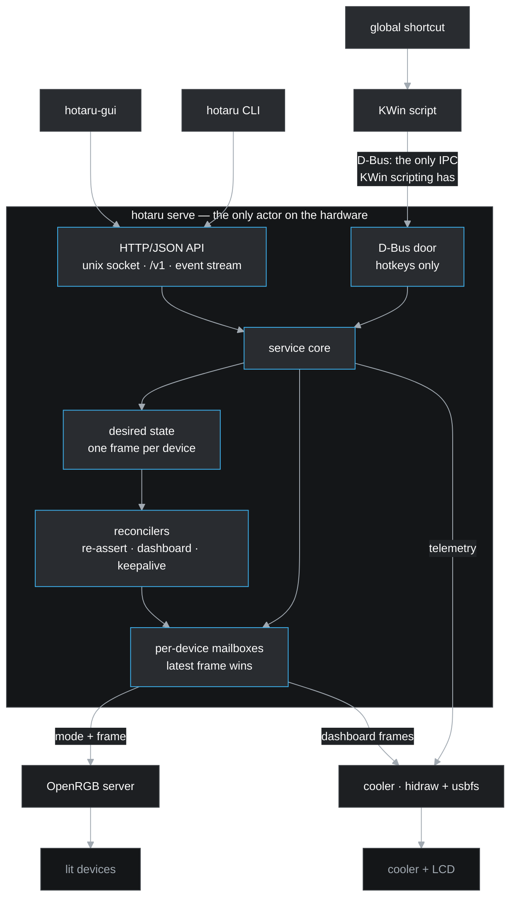

# hotaru (蛍)

*lights, cooler, action!*

**Version**: 0.1.4

RGB lighting and AIO cooler control for Linux, as a CLI, a user service and a
desktop GUI. 

It drives lighting through [OpenRGB](https://openrgb.org/) and has direct support for an NZXT Kraken Elite LCD screen via direct `/dev/hidraw` and usbfs. The user can set colours down to individual
fans, define scenes, put a live dashboard on the cooler's screen, and bind it
all to keys.

> **Status**: working. lighting, the cooler, its screen, scenes, the
> hotkeys, the CLI, the service and its API, the mapping wizard and the
> window. Tested on two machines with different hardware.
> Remaining items are listed in the [Roadmap](#roadmap).

## Contents

- [What it does](#what-it-does)
- [Install](#install)
- [Architecture](#architecture)
- [What it runs on](#what-it-runs-on)
- [Roadmap](#roadmap)
- [Where it comes from](#where-it-comes-from)
- [Documentation](#documentation)
- [Licence](#licence)
- [Changelog](#changelog)

## What it does

| | |
|---|---|
| **Lighting** | Supports every device OpenRGB can see, addressed by device, zone, LED range, or a segment. The user can label devices in plain words, e.g. "top fan red, bottom fan blue" |
| **Scenes** | A named set of colour assignments, an effect per device and what the screen shows, applied as a previewable unit. |
| **The cooler** | Coolant and CPU temperature, pump and fan speeds, read from the device directly. |
| **The screen** | The cooler's LCD: its own readout, an image, an animation, or a live dashboard rendered from the telemetry |
| **Hotkeys** | Scenes on global shortcuts: nine shipped on `Ctrl+Alt+Num1`–`Num9`, the shifted row left free. Only out of the box supported on KDE Plasma through a KWin script. Other desktop environments can have cli commands bound to their native hotkeys if needed. |
| **A window** | `hotaru-gui`: the machine's devices and zones drawn as a picture of what each is showing, a scene editor you point at a fan, a screen editor, a picture library, and the hotkey binder on the row that shows the key |

## Install

### Arch, and anything using the AUR

```console
$ paru -S hotaru hotaru-gui     # or hotaru alone, on a machine with no desktop
```

[`hotaru`](https://aur.archlinux.org/packages/hotaru) is one PKGBUILD building both, from the release tarball.

`hotaru` is the CLI and the service and needs no graphics stack, so it
installs on a headless box; `hotaru-gui` is the window. Installing pulls in
OpenRGB, because hotaru contains no lighting drivers of its own. See
[docs/packaging.md](docs/packaging.md) for why the backends are hard
dependencies rather than a list of suggestions.

Hotaru supports direct device integration with the NZXT Kraken Elite cooler (LCD screen); fans supported through OpenRGB. Other cooler LCD screens are not currently supported by hotaru.

### Anywhere else

```console
$ go install github.com/ushineko/hotaru/cmd/hotaru@latest
$ go install github.com/ushineko/hotaru/cmd/hotaru-gui@latest   # needs cgo and OpenGL
```

The service unit, the desktop entry and the udev rule are in
[`packaging/`](packaging/) to copy into place. A release also carries built
binaries.

### Then, once

```console
$ systemctl --user enable --now hotaru
$ loginctl enable-linger $USER    # so lighting comes back at boot, not at login
```

Starting the daemon and turning on the user
manager at boot is the prerequisite. `hotaru light health` will tell you if anything is missing.

The cooler needs no root. logind puts an ACL on a device the package's udev
rule tags, but the rule only applies to a device plugged in after it lands.
The first run after installing may want a reboot or
`udevadm trigger`. `hotaru light health` will report the devices it can see.

### And then

```console
$ hotaru light list        # what it found
$ hotaru light set red     # it works
$ hotaru wizard            # name this machine's lights by looking at them
```

The wizard is optional. With no configuration at all, every device OpenRGB
reports is in scope and every decision comes from what the hardware says about
itself.

## Architecture

Three components: a resident service that owns the hardware, and a CLI
and GUI that are clients of it.



Salient design decisions:

- **The service is the only writer.** No shell ever holds a device handle. Two
  callers cannot fight over a device because there is only ever one caller.
- **The API is the contract.** HTTP and JSON over a Unix socket in
  `$XDG_RUNTIME_DIR`.
- **Machine, not desktop scoped.** The service is a user
  unit with no session dependency, so the lights come back at boot. Hotaru waits intelligently for OpenRGB to fully identify its devices before proceeding.
- **The service reconciles state.** hotaru maintains the scene as an active daemon so devices can't drift or fail to configure.
- **It is fast.** Native Go, callouts to OpenRGB SDK, backend is REST over UNIX domain sockets. Cooler LCD display support is native Go. No external programs needed. No python needed.
- **Plays nice with others.** With nothing recorded, hotaru discovers your
  hardware and touches none of it until asked.
- **Designed to work out of the box.** Built in wizard, config, and diagnostics. Implements reasonable defaults. 

Full detail is in [docs/architecture.md](docs/architecture.md).

## Supported platforms

Linux, KDE Plasma 6.x. Developed on Arch/CachyOS but may work on other distros. The core is
portable. You will have the best experience on KDE Plasma/CachyOS.

**Lighting is owned by OpenRGB**. hotaru does not do lighting itself. The cooler is the
exception: hotaru speaks NZXT's protocol directly, so telemetry and the screen
do not depend on liquidctl (python) (spec 012).
[docs/hardware.md](docs/hardware.md) lists what has actually been tested, and
points at OpenRGB's own device list for everything else.

Nothing is assumed about your hardware. All features should work consistently everywhere. However, some functions such as the ability to display the LCD dashboards, pictures, and animated GIFs, require a supported cooler display.

## Roadmap

| Spec | | |
|---|---|---|
| 001 | Scope, migration contract, and the baseline: the service, its API, and lighting | **done** — [#1](https://github.com/ushineko/hotaru/issues/1) |
| 008 | The mapping wizard: naming a machine's lights by looking at them | **done** — [#10](https://github.com/ushineko/hotaru/issues/10) |
| 002 | Cooler telemetry behind the same API | **done** — [#2](https://github.com/ushineko/hotaru/issues/2), and replaced by [spec 012](specs/012-the-cooler-without-liquidctl.md): hotaru reads the cooler itself |
| 003 | The LCD and the dashboard | **done** — [#3](https://github.com/ushineko/hotaru/issues/3) |
| 004 | Scenes, preview and leases | **done** — [#4](https://github.com/ushineko/hotaru/issues/4) |
| 005 | The GUI on [fynedesygn](https://github.com/ushineko/fynedesygn) | **done** — [#5](https://github.com/ushineko/hotaru/issues/5), built out over specs 017 to 034 |
| 006 | Hotkeys and the cutover | **done** — [#6](https://github.com/ushineko/hotaru/issues/6) |
| 007 | Packaging and release | **done** — [#7](https://github.com/ushineko/hotaru/issues/7) |


## Where it comes from

The progenitor of this project is  `peripheral-battery-monitor`, a KDE tray widget for
peripheral battery levels that grew a cooling monitor, an LCD dashboard, an RGB
controller and a hotkey host. It was big and ugly, and this is not.

hotaru is a ground-up rearchitecture. Hardware learnings are carried over.

## Documentation

* specs - design decisions and feature development.
* docs - adjunct documentation such as architecture.

## Licence

MIT. See [LICENSE](LICENSE).

## Changelog

### 0.1.4 (2026-09-22)

- The scene editor sets what each device does with the colours. A scene has
  carried a mode per device since spec 015 and only the wizard ever asked; the
  window could do less than `hotaru scene write --effect`. Each row says what
  the device is doing now, because "leave it alone" means nothing on its own
  (spec 038, #94).

- A scene's style can be given to other scenes. `hotaru scene style <from>
  <to>...`, and the same from the editor. It replaces rather than merges, and
  a wrong name changes nothing at all (spec 038, #94).

- `hotaru image scene --effect` and the window's "Make a scene" take effects.
  A picture says what colour each light should be and nothing about the mode a
  device runs. Recolouring keeps them (spec 038, #94).

- Create opens on Scenes, then Pictures, then Screen. A picture becomes a
  screen and a screen goes in a scene exactly once per picture; the scene list
  is what the window gets opened for.

- A build that is not the release says so: `0.1.3-1a2b3c4-dev` unless HEAD is
  on the version's tag with a clean tree. Packages stamp their own version and
  are unaffected.

### Unreleased

- Numpad shortcuts do not fire on a machine whose keyboard is shared over
  deskflow. Everything else about them works: the script loads, the actions
  register, and invoking one applies the scene. Non-numpad bindings work
  there. Documented in
  [docs/hardware.md](docs/hardware.md#the-numpad-over-a-shared-keyboard);
  forwarded keyboards commonly lose modifier and lock state, which is a class
  of problem rather than one tool's bug.

### 0.1.3 (2026-09-21)

Both found by building the package, whose `check()` runs the test suite.

- Opening the screen editor no longer edits the screen. Two of the new
  choosers did not check whether anything had moved, so drawing the form wrote
  a font into the dashboard and requested a frame (spec 037).

- The window's tests wait for the work they start. Fyne's test driver runs
  `fyne.Do` inline, so a goroutine outliving its test shaped text while the
  next test drew, and the shaper panicked. It failed one package build in
  three.

### 0.1.2 (2026-09-21)

- The screen builder sets the lettering: the font, and a size, a colour and an
  outline for the labels and the readings separately. Size is a percentage of
  what the arrangement draws, so its proportions survive. The coolant keeps
  its own green, amber and red, because that colour carries the alert
  thresholds (spec 037, #88).

- A picture with more colours than a GIF holds no longer draws nothing. The
  palette was 33 interface colours plus up to 236 from the picture, which is
  269, and the encoder's error was discarded: a busy photograph came back as a
  zero-byte frame (spec 037).

### 0.1.1 (2026-09-21)

Everything here was found by installing 0.1.0 on a second machine.

- A key that is not on the numpad can be bound from the window. Every shipped
  key is a numpad key, and the chooser offered only those eighteen, so a
  machine without a numpad had nine shortcuts it could not press.
  `hotaru keys bind` always took any sequence (spec 035, #83).

- A picture dropped on the window lands on the part that takes it. "Pictures"
  stopped being a section when it moved under Create, and asking for it by
  that name sent the window to the service page (spec 036, #84).

- On fynedesygn v0.1.38, whose `Shell.Select` now ignores a title no section
  has instead of navigating to the first one.

- The service makes its own directories. `ProtectHome=read-only` grants a
  `ReadWritePaths` entry only if the directory already exists, so a fresh
  install could not create `~/.local/share/hotaru` and the first picture
  failed with "read-only file system" (spec 007).

- A service with no image library says why. The reason was in the startup log
  and nowhere the user would look.

### 0.1.0 (2026-09-21)

The first tagged release: lighting through OpenRGB down to a single LED, a
liquid cooler read and driven directly, its screen showing a picture or a live
dashboard, scenes on global shortcuts, a mapping wizard, and a window for all
of it.

- The window's hold on the hardware has a test, against a real service: the
  lease is taken once and kept across colours, and releasing it puts the
  lights back (spec 018).

- The AUR package, the udev rule that lets the service open the cooler without
  root, and an Install section in this README. Without the rule hotaru finds
  the cooler and cannot open it, so lighting works and telemetry and the
  screen do not (spec 007, #7).

- Pictures are a grid of tiles rather than a column of cards. The grid reflows
  to the window's width, and thumbnails are drawn from the shared cache and
  decoded off the drawing thread (spec 034, #77).

- Listing pictures does not decode them. `Image.Frames` was counted with
  `gif.DecodeAll`, which decompresses every frame of every file: 110 MB of
  animation took 1.28 seconds, and the window requests that list whenever the
  Pictures section is drawn. Counting image descriptors takes 0.019 seconds
  (spec 034, #77).

- System states which display was found: the panel the cooler model has,
  "none" for a cooler without one, or the panel and the reason it cannot be
  reached. `hotaru cooling` reports the same (spec 032, #73).

- A screen that will not open is an absence rather than a fault. Previously
  every scene reported a permission error permanently, and the dashboard loop
  retried every two seconds for the life of the service. The lights still
  work, the loop stops after one refusal, and screens can still be built and
  previewed (spec 032, #73).

- `hotaru scene adopt` copies the pictures scenes point at into the library, so
  they can be chosen in the window and survive the original moving. The
  original file is left in place (spec 033, #74).

- Colours taken from a picture can be pushed apart. The mean of each slice is
  weighted by chroma, and a separation slider scales each colour away from the
  picture's average hue. `hotaru scene recolour` does it at the terminal, and
  a dashboard works as a source the same way a picture does (spec 029, #70).

- Pictures, Screen and Scenes are one entry called Create, and Cooling is part
  of System. System also states what is loaded: the scene last applied and
  what the panel is showing, refreshed on the poll rather than rebuilt
  (spec 030, #71).

- A row's buttons sit beside its content rather than at the window's edge: 4
  pixels from the last column against 1,471. Every column holds a width, so
  rows line up down the list (spec 031, #72).

- The screen chooser opens immediately. It requested the pictures and
  dashboards once for the list and again for every line in it, 30 round trips
  on the drawing thread; the list is now fetched once and refreshed on
  arrival. Its thumbnails line up with the options (spec 031, #72).

- The window has an Appearance section: the scheme, the font, the text size
  and the interface scale.

- Tables in the About section render as tables, from fynedesygn v0.1.34.

- A scene's shortcut is changed from the row that shows it. The chooser offers
  every key with what it currently holds. Moving one is an unbind and a bind,
  and binding reinstalls the desktop's script, which carries the scene name
  rather than the key (#66).

- Dialogs holding a list open at most of the window, through fynedesygn's
  `dialogs.Roomy`.

- Choosing a dashboard takes the screen back. Anything that puts a picture on
  the panel holds the dashboard, and only asking for the dashboard releases
  it. Saving a dashboard does not take the screen (#64).

- Thumbnails are decoded once, small, and shared. The Pictures section cached
  file bytes and handed them to Fyne, which decodes a GIF in full to draw a
  96-pixel square. A minute of switching sections peaks at 271 MB of live heap
  against 444 MB, with images down from 202 MB to 21.6 MB (spec 027, #60).

- Ctrl+1 to Ctrl+9 switch sections, from fynedesygn's shell.

- A scene's lines are a list rather than a column. A scene naming lights
  individually has 225 of them, each seven objects Fyne measured on every
  layout. Resizing the editor with that scene loaded fell from 9.16 s of CPU
  in a 25-second drag to 6.10 s, and from 18.84 s before this work
  (spec 026, #59).

- Resizing the scene editor costs half what it did. Each light block was a
  rectangle with an invisible button over it, five objects per block; they are
  `widgets.Swatch` now, one widget each. A 25-second drag fell from 18.84 s of
  samples to 9.16 s (spec 025, #57).

- The window is built without Fyne's thread-safety check, which was 82% of the
  CPU of a window drag: Fyne calls `runtime.Stack` on every canvas refresh to
  identify its goroutine. Resize work fell 3.8x. Safe because
  `internal/gui/thread_test.go` fails the build if anything inside a `Perform`
  callback touches the interface unwrapped. Use `make install`; `go install`
  misses the tag (spec 024, #55).

- The window can be profiled. `HOTARU_PPROF=:6060 hotaru-gui` serves
  `net/http/pprof` on loopback, under a soft 512 MiB ceiling that `GOMEMLIMIT`
  and `HOTARU_MEMLIMIT` override. Both come from fynedesygn's `profiling`
  package, whose
  [performance guidance](https://github.com/ushineko/fynedesygn/blob/main/docs/performance.md)
  covers reading the output.

- The cooler's screen is configurable. Named dashboards, saved and switched
  like scenes: four arrangements, any of the nine readings per slot with its
  own label, rings that each track a reading, four themes, a caption, and a
  starfield, plain colour or picture background. Text over a picture is
  outlined. `hotaru dashboard list|show|save|use|preview|delete`, an editor in
  the window with a live preview, and `screen: dashboard:quiet` in a scene so
  one keypress changes the lights and the screen together (spec 023, #52).

- Five more readings: CPU and GPU utilisation, the pump and fan duty cycles,
  and fan RPM. `hotaru readings` prints all nine with their units. A reading
  is looked up by name, because a dashboard slot holds a name (spec 022, #51).

- Branding: the byline is "lights, cooler, action!", and the bulb's filament is
  an italic H rather than a zigzag that read as an N. A firefly kanji was tried
  and rejected: it draws well at 128 pixels and smudges at 22 (#49).

- The window has an About section, and it is this README: embedded, with the
  architecture diagram rendered at build time and a link to the project.
  `make generate` renders the diagrams (spec 021, #49).

- A scene can be deleted from the window, except a shipped one.

- A scene from a picture. `hotaru image scene <picture> <name>`, and the same
  in the window, lights every zone with the picture's own colours, read across
  the image rather than averaged, and puts the picture on the panel. Each
  slice is weighted by how much colour it carries (spec 020, #47).

- A dropped stack of files all arrives. Four photographs used to process the
  first and discard the rest; they queue now, and more than one is a question:
  four pictures, or one slideshow (spec 020, #47).

- Pictures for the cooler's screen. `hotaru image add <name> <file>` converts
  any JPEG, PNG or GIF to the 640x640 GIF the panel takes, cropped to the
  middle, and keeps it under `$XDG_DATA_HOME`. The window has the same, with a
  file chooser, drag and drop, and a preview of the conversion before anything
  is kept (spec 019, #5).

- The palette is chosen from the picture rather than fixed. Plan 9's 256
  colours spend half their entries on colours a given photograph does not
  contain (spec 019).

- A scene can name a stored picture for the screen, chosen in the editor
  alongside the dashboard and the cooler's own display (spec 019, #5).

- The GUI has a scene editor: click a device or a zone in the picture, give it
  a colour, show the draft on the hardware, save it with a name. Three states
  rather than two: a draft lives in the window, a preview is on the hardware,
  and saving makes it a scene (spec 018, #5).

- Editing a scene keeps what the editor does not edit. A scene's effect per
  device and its screen state pass through untouched (spec 018).

- `POST /v1/preview` previews a scene that was never saved, and `hotaru scene
  preview kraken=red keychron=black` does the same from a terminal. `--detach`
  leaves it up under a token instead of holding it (spec 018, #5).

- `hotaru-gui` has an icon: a lit bulb, flat and geometric because it is drawn
  at 22 pixels in a panel more often than at 128 in a launcher. It ships as a
  desktop entry named for the window's app_id and an SVG in the icon theme,
  which KDE needs before it will draw either (spec 017, #5).

- `hotaru-gui` offers every navigation shape fynedesygn has: labels, icons
  alone, or hidden, on the left or along the top (spec 017, #5).

- `hotaru-gui`, the window: a Service section with health and its remedies, a
  System view drawing every device with its zones proportional to their LED
  counts and in the colours they are showing, and the cooler's numbers beside
  them. A client like the CLI: it holds no device handle, and a test over the
  import graph asserts it (spec 017, #5).

- The window keeps view state in `gui.yml` and nothing else. The service owns
  the rules, the scenes and the desired state (spec 017).

- An image that is not the panel's size is scaled to fit before it is sent. The
  cooler displays nothing at all for an image of the wrong size, with no error
  on either side, which had silently blanked five of the development machine's
  nine LCD animations (spec 016).

- An image larger than four megabytes reaches the cooler's screen. usbfs takes
  one contiguous kernel allocation per transfer, so a bulk write is split into
  one-megabyte pieces. Four of the development machine's nine animations are
  between 9 and 20 MB and none had ever been sent (spec 016).

- Scenes on hotkeys. Nine shipped scenes — red, green, blue, purple, cyan,
  orange, white, magenta and off — on `Ctrl+Alt+Num1` to `Num9`, read out of
  `peripheral-battery-monitor`'s own configuration rather than reinvented.
  `Ctrl+Alt+Shift+Num1..9` are left free (spec 016, #6).

- `hotaru keys` states what is bound, what is reserved, and what else holds
  those sequences, which is the fault that makes a shortcut register
  successfully and then do nothing. `hotaru keys release` removes another
  program's stale entries, in the user's own process rather than the service's.
  `hotaru keys bind` and `unbind` change what a key does (spec 016, #6).

- The KWin script is installed on every appearance of KWin rather than once at
  start-up: the shortcuts live exactly as long as the loaded script, so a KWin
  restart used to take them silently (spec 016, #6).

- A scene can turn the lights off. "Off" resolves the device's own Off mode and
  handles the keyboard that treats black as a dead backlight (spec 016, #6).

- A machine with no cooler does not report a problem when a scene names a
  screen state. Absence is an ordinary answer, and all nine shipped scenes name
  one (spec 016).

- Scenes: `hotaru scene write`, `apply`, `preview`, `save`, `list`, `show` and
  `delete`. A scene is colours addressed at whatever depth was meant, an effect
  per device, and what the cooler's screen shows, applied as a unit and kept,
  so it survives a reboot and hardware that forgets. A scene that says nothing
  about the screen leaves it alone (spec 015, #4).

- `hotaru scene preview` shows a scene without keeping it, and hotaru stops
  re-asserting colours to the devices it covers so the draft is not corrected
  underneath. The preview ends when the command does, including when it is
  killed, and the lights return to what was last applied. `hotaru preview`
  states who holds one; `hotaru preview release` ends it (spec 015, #4).

- A re-assert restores the mode as well as the colours. Invisible while every
  scene was a solid colour, and wrong as soon as one carries an effect
  (spec 015).

- The README, the architecture diagram and the hardware page no longer state
  that the cooler is reached through liquidctl, or that CPU temperature comes
  from OpenLinkHub. Neither has been true since spec 012.

- The cooler's screen shows a live dashboard: coolant temperature with a
  severity-coloured ring, the processor, the graphics card and the pump, over a
  starfield. `peripheral-battery-monitor`'s design, ported constant for
  constant. hotaru pushes only when the picture would differ and never faster
  than the panel settles, a floor set by the encoded frame size. 0.6% of one
  core, measured (spec 013, #3).

- `hotaru screen dashboard` puts the dashboard back after `hotaru screen show`
  or `hotaru screen readout` has taken the panel. The screen holds one picture,
  so it has one author at a time (spec 013, #3).

- `hotaru screen` puts a picture on the cooler's panel, sets its brightness and
  orientation, and hands it back. hotaru hands it back on exit too, so a
  machine no longer running it is not left showing a stale picture
  (spec 012, #2).

- `hotaru cooling` reads the liquid cooler without liquidctl: coolant
  temperature, pump and fan, over `/dev/hidraw` in about two milliseconds
  against 105 through a Python interpreter. A machine with no cooler says so
  and everything else is unaffected (spec 012, #2).

- The wizard ends by offering to light the machine with what it just learned.
  A device named for the first time has no remembered state, so a first run
  used to finish with a written file and a dark keyboard (#34).

- `hotaru light map --devices`, with nothing after it, offers the list to pick
  from. Device names are the hardware's own, long enough to mistype, and a
  mistyped one maps nothing while appearing to work.

- The wizard waits for the hardware before asking what is visible, and asks
  what it never asked before: whether the lights actually go off, what to do
  when they do not, and whether a device that can be dimmed should be. A
  keyboard that takes its lighting back when told to go dark is found and
  recorded rather than leaving `hotaru light off` quietly not working
  (spec 014, #20, #25).

- `hotaru light health` names the OpenRGB unit the machine actually uses. A
  later candidate overwrote an earlier one, so a machine with the user unit
  installed but stopped was told to start the system one (#30).

- A frame is written one request per zone rather than one for the whole device.
  An NZXT cooler's two channels are independent controllers behind one USB
  endpoint, and a single array spanning both was never delivered together: one
  channel held a stale colour, frames rendered torn along a chain of fans, and
  a run of writes stopped the device responding for minutes (spec 011, #24).

- The mode packet is sent on every write, including to a device already in that
  mode. It looks redundant and is the commit: suppressing it stopped an NZXT
  cooler changing colour at all (spec 010, #23).

- `--preview` on `hotaru light set` and `hotaru light off`: write a colour to
  the hardware without making it the state the machine returns to (#18).

- A solid colour is set on the mode as well as on the device's buffer, where
  the mode carries its own. Without it a device showed the colour its vendor
  last stored there: asked for purple, an NZXT cooler lit three radiator fans
  red and every check reported success. hotaru also prefers a mode whose colour
  it sets per LED, because that is the one it can read back and verify
  (spec 009, #16).

- The wizard asks how many things are chained on a part only where that part is
  a line of lights. A keyboard's keys are addressable and are not a chain
  (spec 008, #15).

- The mapping wizard: `hotaru light map` lights one thing at a time and asks
  what is visible, and the names given become the ones used. Tested end to end
  on a machine the author has never seen (spec 008, #10).

- Desired state, and the reconciler that restores it: at boot, when a device
  wakes having forgotten, and when a server hands devices back with no colour.
  A fresh install remembers nothing and so writes to nothing.

- `hotaru light probe`, `status`, `reconcile` and `reload`; per-device write
  queues where a newer request replaces a waiting one rather than queueing
  behind it; and the systemd user unit, which depends on no OpenRGB unit and no
  desktop session.

- `hotaru serve` and the CLI: the service on its Unix socket, `/v1` for health,
  devices and lighting, and `hotaru light list|set|off|health` as its first
  client. The client commands import no device package, which a test asserts.

- Spec 001: project scope, the migration contract from
  `peripheral-battery-monitor`, the KDE hotkey rules, and the baseline of
  service, API and lighting
  ([#1](https://github.com/ushineko/hotaru/issues/1)).

- The architecture and the packaging plan, decided ahead of implementation.
