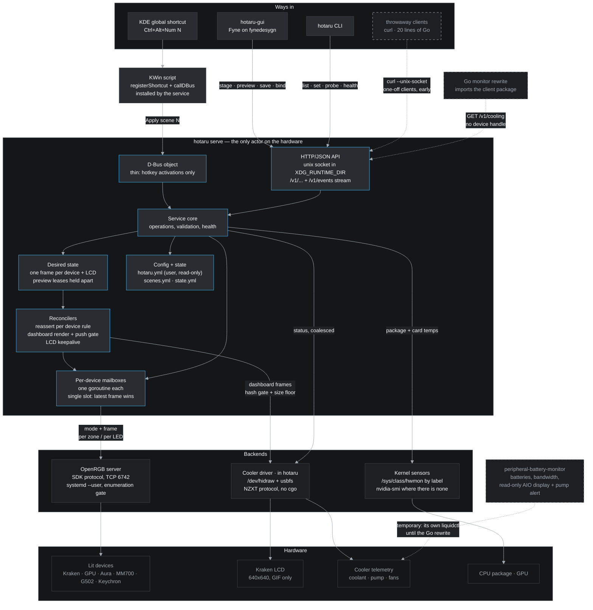
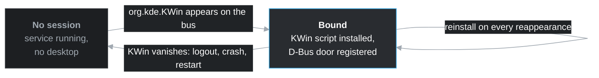

# hotaru architecture

The shape of the system as decided so far. The source of record for *why* any of
it is this way is `specs/001-scope-migration-and-lighting-core.md`; this page is
the picture, and it is updated in the same commit as any decision that changes
it.

## The system

Colours are Breeze Dark, the same palette `fynedesygn` ships as its default
scheme, so the diagram matches the program it describes. It renders dark
whatever the viewer's theme is — deliberate, since that is how the work is read.

**Solid** is the architecture after cutover. **Dashed** is either temporary (the
monitor reading the cooler for itself until its Go rewrite) or not yet built
(the CLI's direct path exists only until the service does; the Go monitor is a
direction, not a commitment).

## Boot and readiness

The service starts with the machine. Nothing below waits for a login, and
nothing treats "the unit started" as "the hardware is there".

**Why there is no "wait for OpenRGB" edge at the start.** hotaru declares no
`After=` or `Requires=` on any OpenRGB unit. There is no single unit to name —
the `openrgb` package ships a system one, this machine runs a user one, other
people start it by hand — and ordering would not help regardless: a cold boot
has been observed reaching `Started` with two devices of six enumerated, because
OpenRGB detects once and USB enumeration had not finished. Readiness is judged
by the device list, which is why **Partial** is a state of its own rather than a
successful restore with fewer lights than expected.

## Session attachment

The desktop is not a precondition for anything. It is something that shows up,
possibly more than once.

Watching the bus name rather than installing once at start-up is what makes the
bindings as durable as the desktop instead of as durable as one moment in it —
the old implementation installed at program start, so a KWin restart silently
took the shortcuts and left a program that believed it still had them.

## What the picture is asserting

- **One actor, from the first commit.** Every write to every device leaves
  through the per-device mailboxes inside the service. No shell holds a device
  handle — the CLI is an API client from the day it exists, so there is no
  direct-write path to remove later. Two callers cannot fight over a device
  because there is only ever one caller.
- **Two doors, one flow.** The HTTP API is the interface; the D-Bus object
  exists only because KWin scripting can reach nothing else. Both terminate in
  the same service core.
- **Desired state is separate from what is on the hardware.** Reconcilers close
  the gap on a timer, because some devices do not hold what they are told (the
  wireless G502 restores onboard state on wake) and the LCD drops a static image
  within seconds. A preview is held apart from desired state so it cannot be
  mistaken for an instruction.
- **Latest wins per device, and the unit is a frame.** Lighting addresses
  targets — device, zone, LED range or named segment — and the assignments for a
  device compose into one complete frame before anything is written. That is
  what makes a write atomic from the device's point of view, and what lets a
  single-slot mailbox coalesce without dropping half a scene.
- **Two paths, one device.** The Kraken's lighting is OpenRGB's; its telemetry
  and its screen are hotaru's own, spoken to over `/dev/hidraw` and usbfs. The
  split is the hardware's rather than a preference: OpenRGB exposes the colour
  channels and nothing else, and liquidctl — which used to fill the gap —
  exposes no colour channels for this model at all. Doing the cooler directly
  took a Python interpreter and a subprocess per reading out of the service,
  and a reading from 105 ms to about two (spec 012).
- **One writer per file.** Rules are the user's and are never rewritten;
  scenes are machine-written because the GUI edits them; desired state lives
  outside the config directory entirely; and the GUI's own file holds nothing
  but view state. YAML throughout, which is why the file the user comments is
  not one the program ever serialises back.
- **The service starts at boot, not at login.** A user unit with no desktop
  dependency, restoring recorded state by reconciling toward it. The OpenRGB
  server is a resource that appears rather than a unit to order after — started
  is not ready, as a cold boot finding two devices of six demonstrated. Desktop
  pieces such as the KWin script attach when the session shows up and reattach
  when it restarts.
- **Every backend is optional.** OpenRGB, the cooler and the kernel's sensors
  are independent legs; any of them missing removes its capabilities from the
  API and the GUI without failing the others or stopping the service. A machine
  with no liquid cooler is the ordinary case, not an error, and says so through
  the same route a reading would take. The KWin script is a KDE convenience —
  elsewhere the CLI is the binding mechanism.
- **The monitor is a consumer, eventually.** It keeps its own reads for now —
  an accepted, temporary overlap — and becomes an API client when it is
  rewritten in Go.

## Keeping it current

Update this diagram in the commit that changes the decision, not afterwards. It
is a `mermaid` block in Markdown so it renders in Zettlr and on GitHub without a
build step; the theme is pinned in the block's `init` directive, so editing the
diagram does not mean re-choosing colours. Once the Go project exists, it moves to the fynedesygn convention —
a `.mmd` source rendered to PNG by `mmdc` under `go generate`, with the PNG
committed — so the gallery and the docs pane can show it too.
