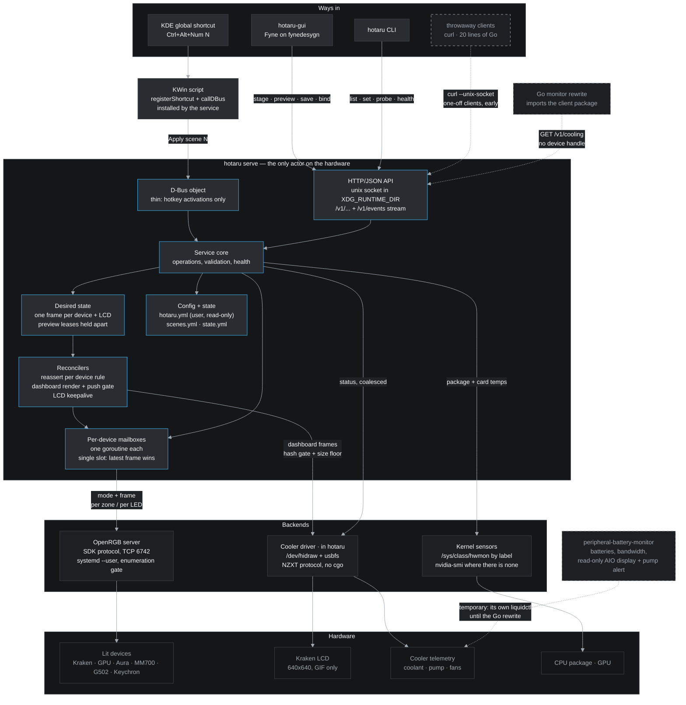
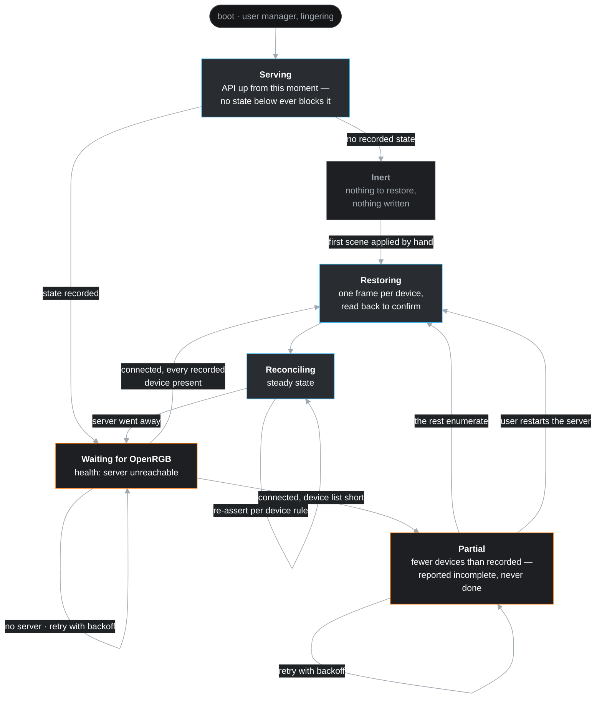
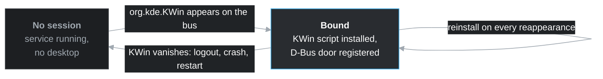

# hotaru architecture

The shape of the system as decided so far. The source of record for *why* any
of it is this way is `specs/001-scope-migration-and-lighting-core.md`. This
page is the picture, and it changes in the same commit as any decision that
changes the system.

## The system

The colours are Breeze Dark, the palette `fynedesygn` ships as its default
scheme, so the diagram matches the program it describes. It renders dark
whatever theme the viewer uses. That is deliberate, because that is how the
work is read.

**Solid** is the architecture after the cutover. **Dashed** is one of two
things. It is temporary, like the monitor reading the cooler for itself until
its Go rewrite. Or it is not built yet: the CLI's direct path exists only
until the service does, and the Go monitor is a direction rather than a
commitment.

## Boot and readiness

The service starts with the machine. Nothing below waits for a login, and
nothing reads "the unit started" as "the hardware is there".

**Why there is no "wait for OpenRGB" edge at the start.** hotaru declares no
`After=` or `Requires=` on any OpenRGB unit. No single unit exists to name: the
`openrgb` package ships a system unit, this machine runs a user unit, and
other people start the server by hand. Ordering would not help in any case. A
cold boot has reached `Started` with two devices of six enumerated, because
OpenRGB detects devices once and USB enumeration had not finished. hotaru
judges readiness by the device list instead. That is why **Partial** is a
state of its own, rather than a successful restore with fewer lights than
expected.

## Session attachment

The desktop is a precondition for nothing. It appears, and it may appear more
than once.

hotaru watches the bus name rather than installing once at start-up. That
makes the bindings as durable as the desktop, rather than as durable as one
moment in it. The old implementation installed at program start, so a KWin
restart took the shortcuts and left a program that believed it still held
them.

## What the picture is asserting

- **One actor, from the first commit.** Every write to every device leaves
  through the per-device mailboxes inside the service. No shell holds a device
  handle. The CLI is an API client from the day it exists, so no direct-write
  path has to be removed later. Two callers cannot compete for a device,
  because only one caller exists.
- **Two doors, one flow.** The HTTP API is the interface. The D-Bus object
  exists only because KWin scripting can reach nothing else. Both end in the
  same service core.
- **Desired state is separate from what is on the hardware.** Reconcilers
  close the gap on a timer, because some devices do not hold what they are
  told. The wireless G502 restores its onboard state on wake, and the LCD
  drops a static image within seconds. hotaru holds a preview apart from
  desired state, so that nobody mistakes a preview for an instruction.
- **Latest wins per device, and the unit is a frame.** Lighting addresses
  targets: a device, a zone, an LED range or a named segment. The assignments
  for one device compose into one complete frame before anything is written.
  That makes a write atomic from the device's point of view, and it lets a
  single-slot mailbox coalesce writes without dropping half a scene.
- **Two paths, one device.** The Kraken's lighting belongs to OpenRGB. Its
  telemetry and its screen are hotaru's own, over `/dev/hidraw` and usbfs. The
  hardware sets that split rather than a preference. OpenRGB exposes the
  colour channels and nothing else, and liquidctl, which used to fill the gap,
  exposes no colour channels for this model at all. Reading the cooler
  directly removed a Python interpreter and a subprocess per reading from the
  service, and took a reading from 105 ms to about two (spec 012).
- **One writer per file.** The rules belong to the user, and hotaru never
  rewrites them. hotaru writes the scenes, because the window edits them.
  Desired state lives outside the config directory. The window's own file
  holds view state and nothing else. Every file is YAML, which is why the file
  the user comments is never one the program writes back.
- **The service starts at boot, not at login.** It is a user unit with no
  desktop dependency, and it restores recorded state by reconciling toward it.
  The OpenRGB server is a resource that appears, rather than a unit to order
  after. Started is not ready, as a cold boot that found two devices of six
  showed. The desktop pieces, such as the KWin script, attach when the session
  appears and attach again when it restarts.
- **Every backend is optional.** OpenRGB, the cooler and the kernel's sensors
  are independent legs. A missing leg removes its capabilities from the API
  and the window, and the others continue. The service keeps running. A
  machine with no liquid cooler is the ordinary case rather than an error, and
  it reports that through the same route a reading would take. The KWin script
  is a KDE convenience, and away from Plasma the CLI is the binding mechanism.
- **The monitor is a consumer, eventually.** It keeps its own reads for now,
  which is an accepted and temporary overlap. It becomes an API client when
  somebody rewrites it in Go.

## Keeping it current

Update this diagram in the commit that changes the decision, rather than
afterwards. It is a `mermaid` block in Markdown, so it renders in Zettlr and
on GitHub without a build step. The block's `init` directive pins the theme,
so editing the diagram does not mean choosing colours again. Once the Go
project exists, the diagram moves to the fynedesygn convention: a `.mmd`
source that `mmdc` renders to PNG under `go generate`, with the PNG committed.
The gallery and the docs pane can then show it too.
